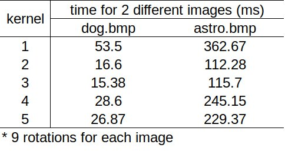
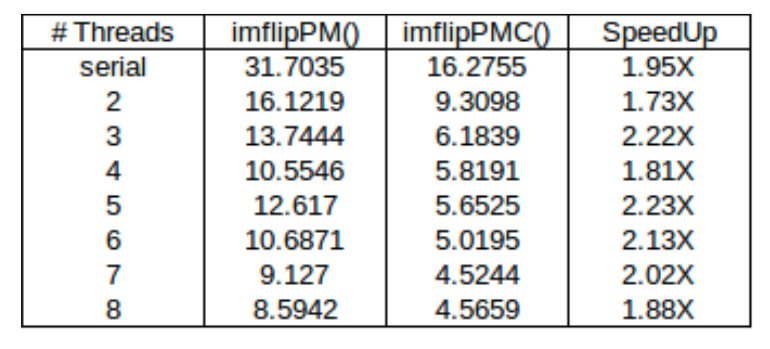

# Parallel Computing with GPU and CPU

This project includes multi-thread GPU and CPU computing algorithms for vertically/horizontally flipping, rotating,  and edge detection algorithms based on c and cuda. 

##### 1. cuda image rotating

/Example/cuda_imrotate/* includes the cuda implementation for rotating images using GPU parallel computing. 


imrotateG.cu : Serially rotating an image for 360 degrees. 

```
./imrotateG infile outfile N
# N - number of rotations
```

imrotateGS.cu : improved on imrotateG.cu by using shared memory, which reduces the number of memory accesses. 

```
./imrotateGS infile outfile N
```

imrotateGS2.cu : improved from imrotateGS.cu by balancing the number of shared memory and thread per block. 

```
./imrotateGS2 infile outfile N [kernelNum 1-5]
# Kernel 1 is the same in imrotateGS
# Kernel 2-5 are four different improvement
```

kernel running time for rotating 2 different images 9 times. dog.bmp is 22 MB and Astro.bmp is 128 MB.




##### 2. CPU multi-threading (p_thread)

###### 2.1 image flip

Example/p_thread/flip/imflipPMC.c contains 2 image flipping functions imflipMP() and imflipPMC(). Since the native data size for CPU is 64 bit (8 bytes), imflipPMC() optimized the data process by GPU by access 24 bytes (8 pixels). Using bit operation combining this data access method could drastically improve the running time. 

```
./imflipPMC infilename.bmp outname.bmp numThreads [version: 0-3]
```



###### 2.2 image rotate

Example/p_thread/rotate/imrotateMMC.c improved version of multi-threading image rotation, including memory access improvement, core operation improvement and asynchronous multi-threading with inter-lock (Rotate9()). 

```
 ./imrotateMMC inputBMP outputBMP [RotAngle] [NumThreads : 1-128] [Function:1-6]
```


#### basic utility function

##### 3. GPU parallel computer with cuda implementation

###### 3.1 Image flip

/utils/cuda/flip/* 

imflipG.cu : cuda implementation for horizontally/vertically flip, transpose, and copy an image. 

```
./imflipG InputFilename OutputFilename [V/H/C/T] [ThrPerBlk]
# V-vertical flip
# H-horizontal flip
# C-copy an image
# T-transpose an image
# ThrPerBlk-number of thread per cuda block
```

imflipGCM.cu : improved on imflipG.cu by optimizing the core operations and memory access. Methods include: reducing core operations and registers in each kernel, using shared memory, processing multiple pixels for to improve memory access, and use 2 dimensional blocks.  

```
./imflipGCM InputFilename OutputFilename [V/H/C/T] [ThrPerBlk] [Kernel=1-9]
# kernel 1-9 indicate different method to improve kernel running time
```

###### 3.2 image edge detection

/utils/cuda/edge/* 

imedgeG.cu : cuda implementation for obtaining the edges of an image

```
./imedgeG InputFilename OutputFilename [ThrPerBlk] [ThreshLo] [ThreshHi]
```

imedgeGCM.cu : improved based on imedgeG.cu by reducing core operations and memory access time, and constant memories.

```
./imedgeGM.cu InputFilename OutputFilename [ThrPerBlk] [ThreshLo] [ThreshHi] [BWKernel=1-9] [GaussKernel=1-9] [SobelKernel=1-9] [ThresholdKernel=1-9]
```


###### 3.3 image shrunk

/utils/p_thread/shrunk/imshrunkG.cu

cuda implementation of shrinking an image. 

```
./imshrunk input output xshrink yshrink
```


##### 4. CPU multi-threading

###### 4.1 image flip

/utils/p_thread/flip/* includes 
imflip.c : Horizontally or vertically flip an image with single CPU thread. 	  

```bash
 ./imflip [input][output] [V | H]
```

imflipP.c : Horizontally or vertically flip an image with multiple CPU threads. 	  

```
./imflipP input output [v/h] [thread count]
```

imflipPM.c : Improved from imflipP.c by optimizing the memory access for multiple CPU threads, reducing computation for each cores and memory access.

```
./imflipPm input output [v,h,w,i] [0,1-128]
# w--improved vertical flip
# i--improved horizontal flip
```

###### 4.2 image rotation

/utils/p_thread/rotation/* includes 

imrotate.c : Basic multi-thread computing algorithm to rotate an image with given angle and number of thread

```
./imrotate inputBMP outputBMP [RotAngle] [NumThreads : 1-128]
```

imrotateMC.c : improvements based on imrotate.c to optimize the core operation and memory access, reducing computation for each cores and memory access.

```
./inputBMP outputBMP [RotAngle] [NumThreads : 1-128] [Function:1-6]
```

###### 4.3 image edge detection

/utils/p_thread/edge* includes

imedge.c : Basic multi-threading version for image edge detection.

```
./imedge infile outfile [Threads] [ThreshLo] [ThreshHi]
```

imedgeMC.c :  Improvement on imedge.c by optimizing core operations and memory accesses in different ways, reducing computation for each cores and memory access.

```
./inputBMP outputBMP [RotAngle] [NumThreads : 1-128] [Function:1-6]
```

imedgeMCT.c : Improvement on imedgeMC.c by incorporating Asynchronous multi-threading, which uses inter-locking methods to balance the workload of each thread to ensure all threads exits at similar time.

```
./imedge infile outfile [Threads] [ThreshLo] [ThreshHi]  [PrThreads]
```

# Parallel_Computing
# Parallel_Computing
